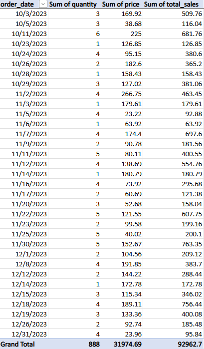

# Excel Sales Analysis

This project demonstrates Excel analysis skills using a mock retail sales dataset. The analysis focuses on building a pivot table to summarize order data.  

## Dataset
Imported from the same dataset used in SQL and Power BI:  
- Customers  
- Products  
- Orders  

## Pivot Table
- Orders summarized by product and customer  
- Total revenue and order count  
- Example filters by product category  

## Skills Demonstrated
- Data cleaning and formatting in Excel  
- Creating pivot tables for analysis  
- Summarizing sales performance  

## Pivot Table Screenshot
  

## Results
- Quick summary of sales by product  
- Easy-to-read pivot table for stakeholders  
- Demonstrates Excel proficiency  
